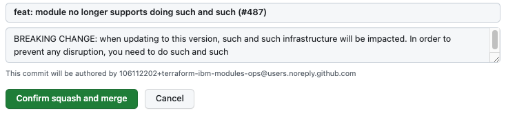

# About merging pull requests

Members of certain teams can merge pull requests in the IBM Cloud Terraform modules project. Maintainers follow a set of guidelines so that the releases are consistent and release notes are useful.

## Who can merge a pull request?

The GitHub teams that have merge access to a repo are defined in the `.github/settings.yml` file in the repo. The file either includes the `branches` setting or has an `_extends` option that points to a common file in the repo-settings repository. If you are a member of a team that's listed for the primary branch at `branches.protection.restrictions.teams`, you can merge pull requests.

```yaml
branches:
  - name: main
    protection:
      # Restrict who can merge to this branch
      restrictions:
        teams: [github-mergers]
```

If the `.github/settings.yml` file doesn't exist, repo settings and merge privileges are defined with normal GitHub settings and access privileges.

?> **Tip**: The `.github/settings.yml` file includes other settings. A [probot](https://probot.github.io/apps/settings/) app enforces the settings in the file.

## Guidelines for merging a PR

As someone with merge responsibilities, follow these guidelines and practices to make sure that changes are released consistently.

### Release level

Use a [conventional commit](https://www.conventionalcommits.org/) prefix for the type of release. For more information about how to determine the release level, see [release versioning](versioning.md).

The merge commit message determines whether a release is created and the level of the release. To generate a release, identify the [conventional commit](https://www.conventionalcommits.org/) type.
- Patch release: Use the `fix:` prefix type. Include details about the changes in the PR in the description and body of the message.
- Minor release: Use the `feat:` type. Include details about the changes in the PR in the description and body of the message.
- Major release: Use `fix:` or `feat:`. Include details about the changes in the PR in the description and body of the message. Include `BREAKING CHANGE:` in the message footer.

?> **Tip**: If a release isn't needed, don't include the prefix type or use one of the following types: `chore:`, `ci:`, `refactor:`, `test:`, `style:`, `docs:`

### Merge commit message

Make sure that the commit message is clear and specific.

The body of the commit message becomes part of the GitHub release notes. Make sure that the message includes the information that users need to know about the release. Write the release notes to help users understand the changes, and include information about how to update from the previous version.

### Squash and merge

Use the **Squash and merge** option when you merge a PR. Status checks prevent the merge if the squash and merge method is not used. For more information, see [Squashing your merge commits](https://docs.github.com/repositories/configuring-branches-and-merges-in-your-repository/configuring-pull-request-merges/about-merge-methods-on-github#squashing-your-merge-commits).

### Example

The following screenshot shows an example of a pull request with a breaking change:


