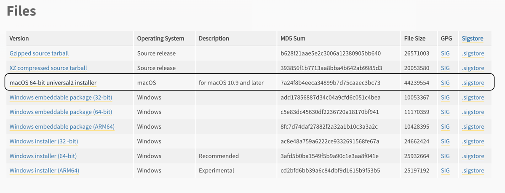

# Latest Python3 installation on macOS

The default Python version (Python 2.x) comes with macOS is not supported. Below are the instructions to install latest Python3 on macOS.  

_Note:_ This guide does not cover `homebrew` based Python3 installation.

1. Navigate to the [official Python download page for macOS](https://www.python.org/downloads/macos/).
2. Click on the latest stable Python release.
3. Under the files tab find the list of installers, click and download macOS appropriate installer locally.
   
4. Follow the steps mentioned in the installer and complete the installation process.
5. Once the installation is completed, run the following command to verify Python installation.
 ```bash
python3 --version
```
